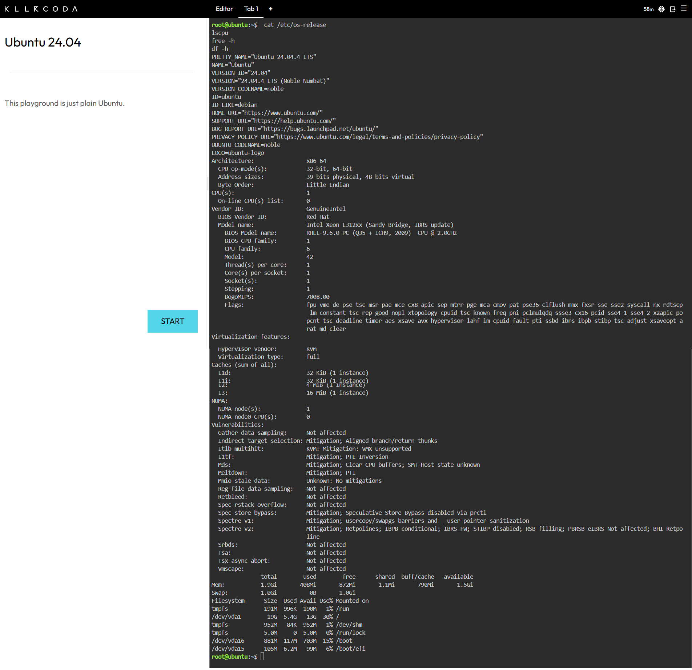

# Mission 3: Become a Multi-Cloud Explorer

## Linux Cloud Server Environment Profile (KillerCoda)
* **Operating System:** Ubuntu 24.04.4 LTS
* **CPU Information:** Intel Xeon E312xx (1 vCPU, 2.0GHz)
* **Memory:** 1.9 Gi Total RAM
* **Disk Space:** 19 GB Total Disk Storage (`/dev/vda1`)

## Cloud Hosting Equivalents
If this KillerCoda Linux server were migrated to the public cloud, it could be hosted on the following equivalent virtual machine services:
* **AWS:** Amazon EC2 (t3.micro or t3.small instance running Ubuntu)
* **Microsoft Azure:** Azure Virtual Machines (Standard_B1s or Standard_B2s instance running Ubuntu)
* **Google Cloud Platform:** Google Compute Engine (e2-micro or e2-small VM instance running Ubuntu)

## Terminal Output Evidence

