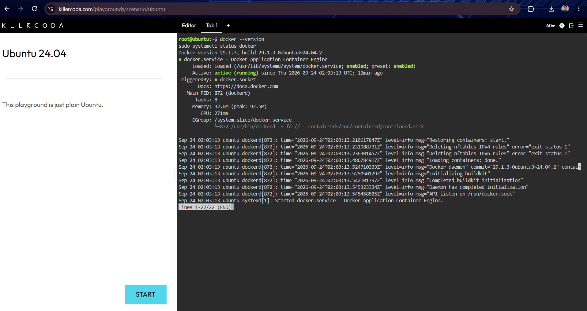
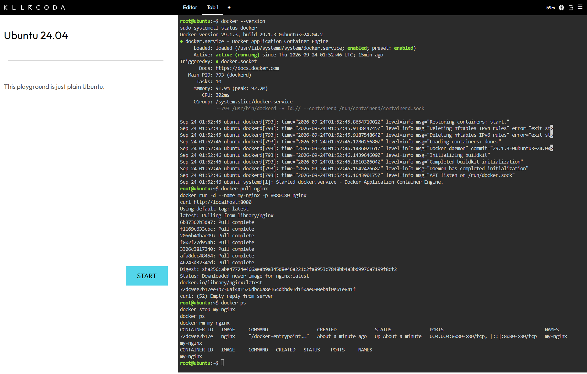
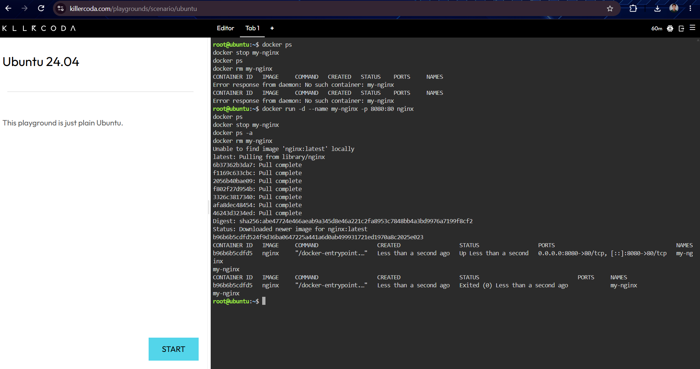

# Mission 4: The Cloud-Native Engineer

## Mission Overview
Transitioning from traditional Virtual Machines to lightweight, portable containerized applications using Docker on KillerCoda.

## Objectives
* Differentiate between VMs and containers.
* Access and verify Docker environments via KillerCoda.
* Execute core Docker CLI commands to pull, run, and manage containers.
* Document container lifecycle operations using Markdown and screenshots.

## Docker Commands Executed
* `docker --version` / `sudo systemctl status docker`
* `docker pull nginx`
* `docker run -d --name my-nginx -p 8080:80 nginx`
* `curl http://localhost:8080`
* `docker ps`
* `docker stop my-nginx`
* `docker rm my-nginx`

## Skills Learned
* Setting up and verifying Docker container runtime environments.
* Managing container lifecycles (start, stop, remove) via CLI.
* Implementing network port mapping for containerized web servers.

## Challenges Encountered
* Ensuring correct mapping between host ports and container internal ports to guarantee local accessibility.

## Evidence (Screenshots)

