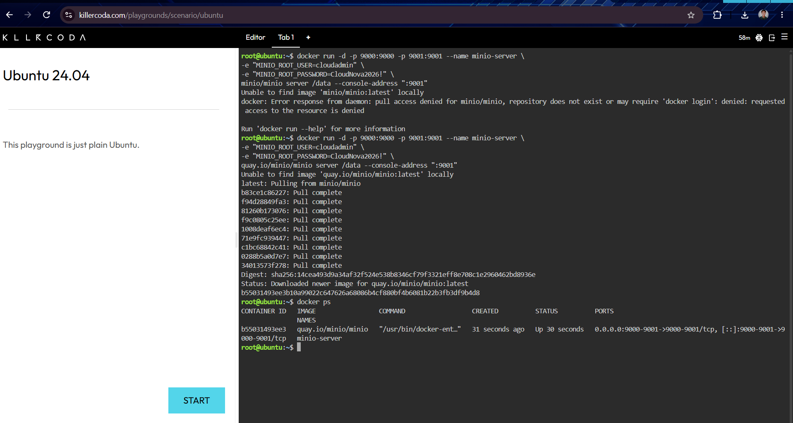
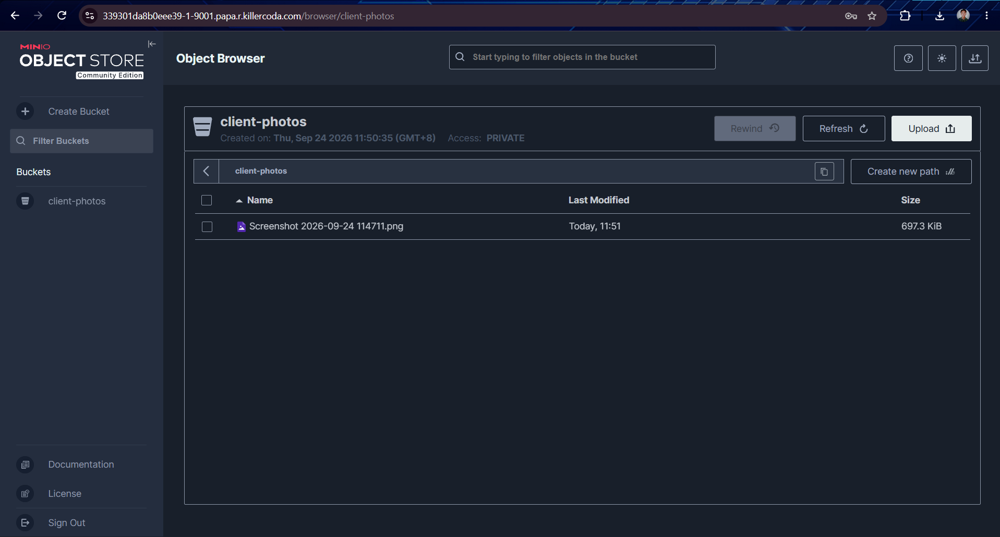

# Mission 5: The Cloud Data Engineer

## Mission Overview
Deploying and managing an S3-compatible cloud object storage server using MinIO and Docker to support scalable, cloud-native data architectures.

## Objectives
* Differentiate between Block, File, and Object Storage.
* Deploy an S3-compatible Object Storage server (MinIO) using advanced Docker environment variables.
* Access cloud management consoles via port forwarding in KillerCoda.
* Create storage buckets and upload media objects through a web interface.
* Document cloud storage configurations and operations using Markdown.

## Tools Used
* KillerCoda Ubuntu Playground
* Docker & Docker CLI
* MinIO Object Storage Server
* GitHub Portfolio

## Skills Learned
* Configuring multi-port container deployments with custom environment variables.
* Interacting with S3-compatible cloud storage web consoles.
* Organizing cloud infrastructure documentation for enterprise clients.

## Evidence (Screenshots)

