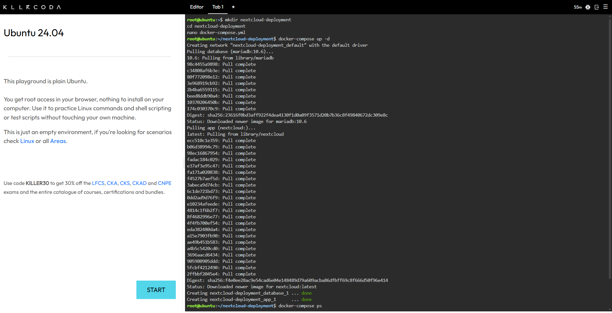
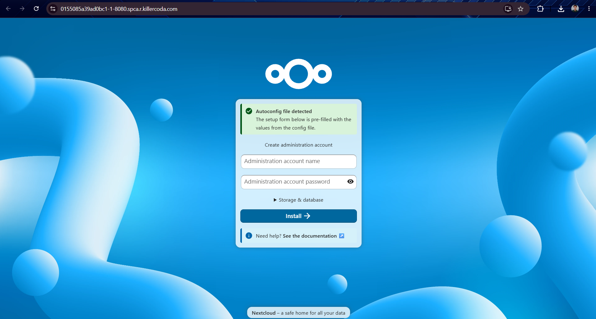
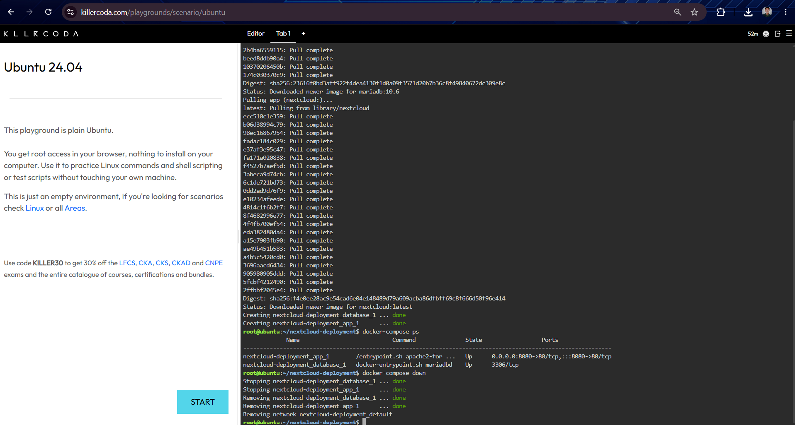

# Mission 6: The Cloud Deployment Engineer

## Mission Overview
Transitioning from manual single-container commands to Infrastructure as Code (IaC) by deploying a multi-tier private cloud storage solution (Nextcloud and MariaDB) using Docker Compose.

## Objectives
* Explain the concept of a multi-tier application architecture.
* Understand the purpose and structure of a `docker-compose.yml` file.
* Use a Linux command-line text editor (`nano`) to create configuration files.
* Deploy a multi-container application using Docker Compose.
* Document deployment procedures and Infrastructure as Code (IaC) principles using Markdown.
* Expand the professional GitHub Cloud Computing Portfolio.

## Commands Executed
* `mkdir nextcloud-deployment`
* `cd nextcloud-deployment`
* `nano docker-compose.yml`
* `docker-compose up -d`
* `docker-compose ps`
* `docker-compose down`

## Skills Learned
* Designing and documenting two-tier application architectures.
* Writing strict YAML configuration files for container orchestration.
* Deploying and tearing down container stacks using Docker Compose.
* Maintaining professional technical documentation and GitHub portfolios.

## Evidence / Screenshots

* **Docker Compose Deployment Status:**
  

* **Nextcloud Web Setup Interface:**
  

* **Docker Compose Teardown Process:**
  
